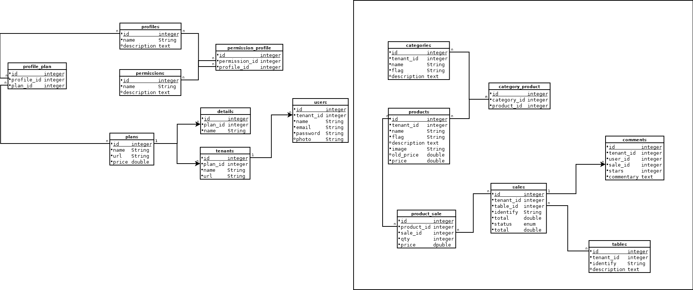

# CURSO LARAVEL (LARAVELFOOD)

https://academy.especializati.com.br/curso/laravel-food


## <a name="indice">Índice</a>

1. [01 - Introdução ao LaraFood](#parte1)     
2. [02 - Gestão de Planos](#parte2)     
3. [03 - Gestão de Detalhes do Plano](#parte3)     
4. [04 - Perfis](#parte4)     
5. [05 - Permissões](#parte5)     
6. [06 - Perfis x Permissões](#parte6)     
7. [07 - Planos x Perfis](#parte7)     
8. [08 - Site e Autenticação](#parte8)     
9. [09 - Cadastro Tenants (empresas)](#parte9)     
10. [10 - Gestão de Usuários](#parte10)     
11. [11 - Categorias](#parte11)     
12. [12 - Produtos](#parte12)     
13. [13 - Produtos x Categorias](#parte13)     
14. [14 - Mesas](#parte14)     
15. [15 - ACL (authorization)](#parte15)     
16. [16 - CRUD de Tenants](#parte16)     
17. [17 - permissions x roles - roles x users](#parte17)     
18. [18 - ACL Authorization (roles x Permissions)](#parte18)     
19. [19 - APIs no Laravel](#parte19)     
20. [20 - API - Autenticação com Sanctum](#parte20)     
21. [21 - API de Pedidos](#parte21)     
22. [22 - Tests no Laravel](#parte22)     
23. [23 - Melhorias e Correções](#parte23)     
---


## <a name="parte1">1 - 01 - Introdução ao LaraFood</a>

- 01 - Pré-requisito Curso LaraFood

- 02 - Apresentação do Modelo de Tabelas do LaraFood



- 03 - Instalando o Laravel 6.x e Configurando

- [larafood](larafood)

- 04 - Versionando o LaraFood com o Git

- 05 - Instalar o AdminLTE 3 no Laravel

- https://github.com/jeroennoten/Laravel-AdminLTE/wiki/Installation

[Voltar ao Índice](#indice)

---


## <a name="parte2">2 - 02 - Gestão de Planos</a>

- 01 - Criar Model e Migration de Planos no Laravel

```
$ php artisan make:model Plan -m

```

```php
    public function up()
    {
        Schema::create('plans', function (Blueprint $table) {
            $table->id();
            $table->string('name')->unique();
            $table->string('url')->unique();
            $table->double('price', 10, 2);
            $table->string('description')->nullable();
            $table->timestamps();
        });
    }
```

```php
class Plan extends Model
{
    use HasFactory;

    protected $fillable = ['name', 'url', 'price', 'description'];
}
```

- 02 - Organizar Rota e Preparar Listagem dos Planos no Laravel

- 03 - Listar os Planos do LaraFood

- 04 - Paginar os Planos do LaraFood

- 05 - Cadastrar Novo Plano no LaraFood

- 06 - Mostrar Detalhes do Plano no LaraFood

- 07 - Deletar o Plano no LaraFood

- 08 - Pesquisar um plano no LaraFood

- 09 - Breadcrumb no LaraFood

- 10 - Melhorias no módulo de planos no LaraFood

- 11 - Atualizar o plano do LaraFood

- 12 - Validar Planos do LaraFood

- 13 - Criar Observer de Plano no LaraFood


[Voltar ao Índice](#indice)

---


## <a name="parte3">3 - 03 - Gestão de Detalhes do Plano</a>


[Voltar ao Índice](#indice)

---


## <a name="parte4">4 - 04 - Perfis</a>


[Voltar ao Índice](#indice)

---


## <a name="parte5">5 - 05 - Permissões</a>


[Voltar ao Índice](#indice)

---


## <a name="parte6">6 - 06 - Perfis x Permissões</a>


[Voltar ao Índice](#indice)

---


## <a name="parte7">7 - 07 - Planos x Perfis</a>


[Voltar ao Índice](#indice)

---


## <a name="parte8">8 - 08 - Site e Autenticação</a>


[Voltar ao Índice](#indice)

---


## <a name="parte9">9 - 09 - Cadastro Tenants (empresas)</a>


[Voltar ao Índice](#indice)

---


## <a name="parte10">10 - 10 - Gestão de Usuários</a>


[Voltar ao Índice](#indice)

---


## <a name="parte11">11 - 11 - Categorias</a>


[Voltar ao Índice](#indice)

---


## <a name="parte12">12 - 12 - Produtos</a>


[Voltar ao Índice](#indice)

---


## <a name="parte13">13 - 13 - Produtos x Categorias</a>


[Voltar ao Índice](#indice)

---


## <a name="parte14">14 - 14 - Mesas</a>


[Voltar ao Índice](#indice)

---


## <a name="parte15">15 - 15 - ACL (authorization)</a>


[Voltar ao Índice](#indice)

---


## <a name="parte16">16 - 16 - CRUD de Tenants</a>


[Voltar ao Índice](#indice)

---


## <a name="parte17">17 - 17 - permissions x roles - roles x users</a>


[Voltar ao Índice](#indice)

---


## <a name="parte18">18 - 18 - ACL Authorization (roles x Permissions)</a>


[Voltar ao Índice](#indice)

---


## <a name="parte19">19 - 19 - APIs no Laravel</a>


[Voltar ao Índice](#indice)

---


## <a name="parte20">20 - 20 - API - Autenticação com Sanctum</a>


[Voltar ao Índice](#indice)

---


## <a name="parte21">21 - 21 - API de Pedidos</a>


[Voltar ao Índice](#indice)

---


## <a name="parte22">22 - 22 - Tests no Laravel</a>


[Voltar ao Índice](#indice)

---


## <a name="parte23">23 - 23 - Melhorias e Correções</a>


[Voltar ao Índice](#indice)

---

